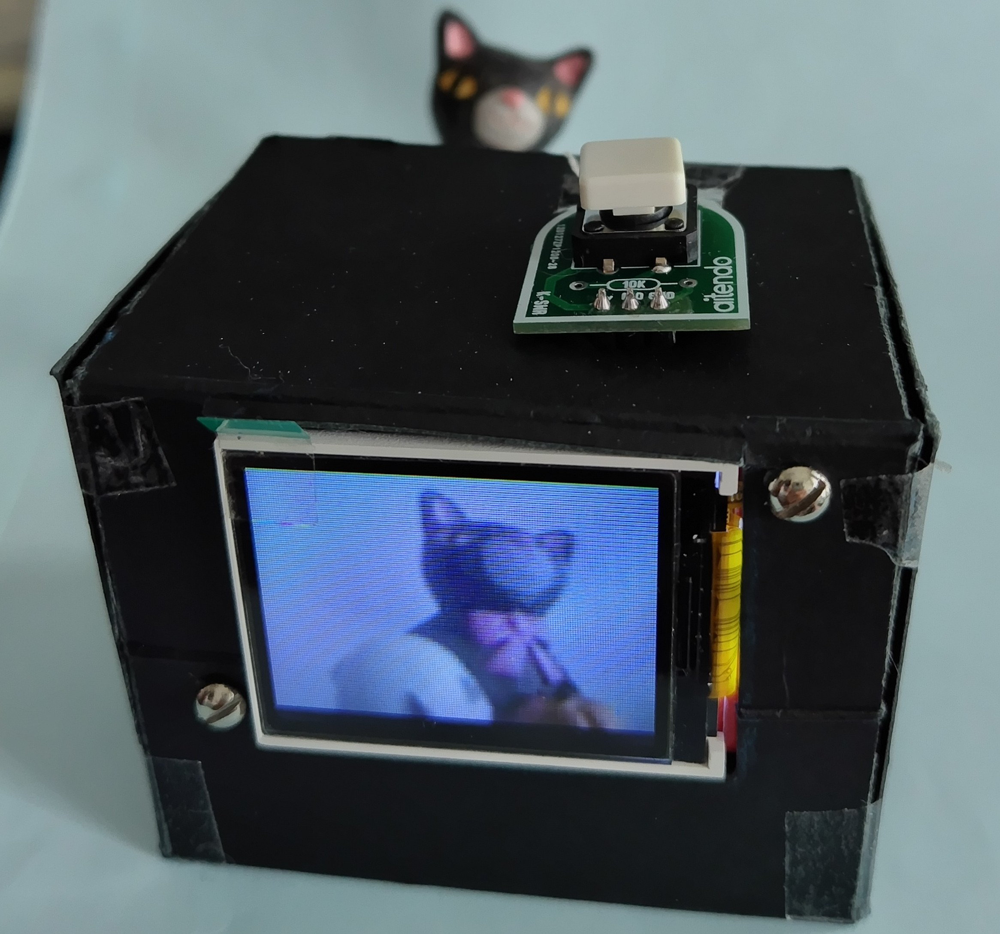
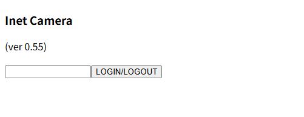
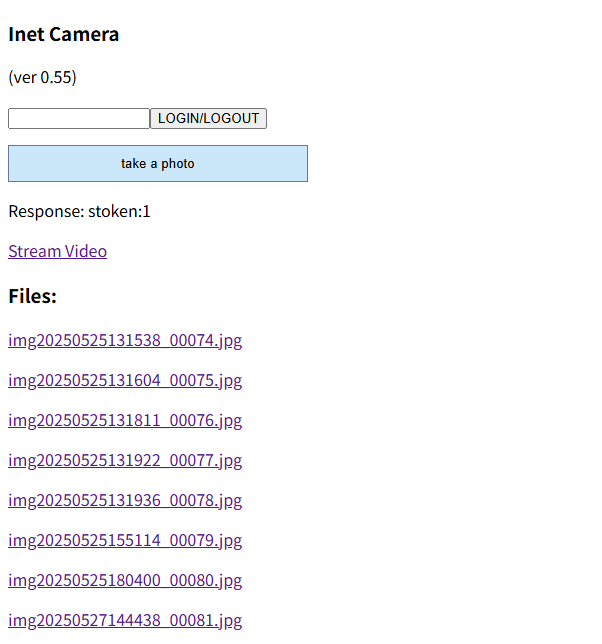

<H3>XIAO ESP32S3 SENSE を使用したトイカメラ</H3>

XIAO ESP32S3 SENSE を使用したトイカメラを製作したので紹介する。 
XIAO ESP32S3 SENSEには、SDカードをサポートするカメラモジュールが付属している。このXIAO ESP32S3 SENSEとモニターとして 
128x160/1.8インチのTFTディスプレイ（ドライバーはST7735））を組み合わせてトイカメラを製作した。 
XIAO ESP32S3 SENSのWiFi機能を利用して、操作はブラウザから行う。 
開発はArduino IDE 2.1で行った。 
XIAO ESP32S3 SENSEについては、<a href="https://wiki.seeedstudio.com/xiao_esp32s3_getting_started/">こちら</a>を参照のこと。

<strong>概要</strong> 

機能は以下の通り。

<ul>
<li>JPGの写真（XGA）が撮れて、XIAO ESP32S3 SENSE内蔵のSDカードに保存できる。</li>
<li>JPGのストリーム画像（XGA）をブラウザから見られる。</li>
<li>保存されたJPGの写真をブラウザから見られる。</li>
<li>モニター画面（TFT、QQVGA）をサポート。</li>
<li>ブラウザから操作して、JPGの写真が撮れる。</li>
</ul>

<strong>H/W構成</strong> 
 ・Seeed Studio XIAO ESP32S3 SENSE - コントローラ 
 ・SPI接続&nbsp; TFTディスプレイ(ST7735) 
 ・シャッター用のボタンスイッチ、配線用ジャンプワイヤー 

 
モニター側から撮影。電源として、外箱の下部に、単三3本（max4.8V）入りの電池ボックスを入れてある。上部のボタンは撮影用シャッターである。

<strong>接続</strong> 
各コンポーネントの接続は以下の通り。 

<table> 
<tr>
<td>SPI</td><td>XIAO</td>
</tr>
<tr>
<td>TFT_MOSI</td><td>GPIO9</td>
</tr>
<tr>
<td>TFT_SCLK</td><td>GPIO7</td>
</tr>
<tr>
<td>TFT_CS</td><td>GPIO3</td>
</tr>
<tr>
<td>TFT_DC</td><td>GPIO4</td>
</tr>
<tr>
<td>TFT_RST</td><td>GPIO2</td>
</tr>
</table>

カメラのシャッター（ボタンスイッチ）は、GPIO1に接続する。ボタンスイッチの接点のうち、もう一方はGNDに接続する。

XIAO ESP32S3 SENSE内蔵のSDカードユニットは、GPIO21で制御するようになっている。 
なお、GPIO21は、XIAO ESP32S3 SENSEのビルトインLEDと共通である。

<strong>インストール</strong> 
<ol>
<li>コードを、ZIP形式でダウンロード</li>
<li>追加のライブラリを、ZIP形式でダウンロード、ライブラリマネージャからインストールする</li>
 <ul>
  <li>Adafruit ST7735（ライブラリマネージャから検索可）</li>
  <li>TimeLib&nbsp;:&nbsp; https://github.com/PaulStoffregen/Time</li>
 </ul>
<li>ArduinoIDEからxiao_sense_vstream_st7735_display_jpgfile_qqvga_sd_master.inoを開く</li>
<li>「検証・コンパイル」に成功したら、一旦、「名前を付けて保存」を行う</li>
<li>SSIDとPASSWORDはアクセスポイントに応じて、プログラムを変更すること。WiFiに接続できない場合は動作不可である。</li>
</ol>

<strong>ブラウザからの利用</strong> 

接続されたIPアドレスは、Arduino　IDEのシリアル出力に表示される。 
そのIPアドレスにブラウザから接続（例えば”http://192.168.0.xx”と指定）すると、次の画面が表示される。 
簡易なログイン機能をサポートしているため、パスコードの入力が必要である。初期値は”123”である（利用時は複雑なものに書き換えることを勧める）。

 

ログインすると、次の画面が表示される。”take a photo”ボタンを押すと、写真が撮影され、JPGファイルがSDカードに保存される。 
ファイル名は、撮影時刻とシーケンス番号で構成される。画面上には、新しいファイルが20枚までリストされる（注 削除はSDカードをパソコンに挿して行う）。 
ファイル名をクリックすると写真がブラウザに表示される。

"Stream Video”をクリックすると、ブラウザにストリーム画像が表示される。ストリームの表示を終了する場合は、ブラウザを終了する。

 

<strong>若干の解説</strong> 
・コード中のWiFiのSSIDとPASSWORDは、利用している無線ルーターのものを指定する。プラグラムの変更で、無線ルーターは2台まで指定することができる。 

<strong>注意事項 
・利用の際は、自己責任でお楽しみください。</strong> 

